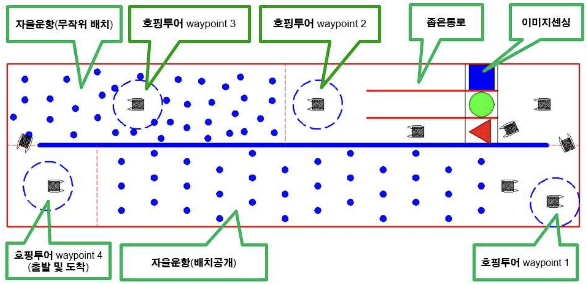

# KABOAT2024
### 충남대학교 SeaNU 2024 자율운항보트 경진대회 종합 1위 (산업통상자원부 장관상)

### [SeaNU 2024 자율운항보트 경진대회 유튜브 영상](https://www.youtube.com/watch?v=IwlfTJ0ziOw)
### [SeaNU 2024 자율운항보트 경진대회 기사](https://www.lecturernews.com/news/articleView.html?idxno=164746)

# 대회 설명

## Mission
1. 장애물을 피해서 목적지 까지 이동
2. 지정된 위치에 특정 시간동안 멈추기
3. 도형, 색깔 이미지를 인식하여 해당 통로로 이동
4. 한 바퀴를 돌아 출발점으로 돌아오기

# Hardware
## 센서부
* RTK-GPS x 2   (SMC-2000, SMC-PLUS)
* 3D Lidar      (MID-360)
* RGB Camera    (ELP-USB-CAM)

## 추진부
* Thruster      (Bluerobotis T200)
* Motor Driver  (Bluerobotis Basic ESC)

## 제어부
* SBC   (Intel NUC)
* MCU   (Arduino Mega 2560)
* RadioMaster TX12 Controller

## 전기
* 24V Battery
* 12V Converter

## 안전
* Emergency Switch
* Relay
* Fan
* RGB NeoPixel LED

# Software
## 개발 환경
* Ubuntu 20.04
* ROS1 noetic
* Unity

## 사용 언어
* Python
* C#

